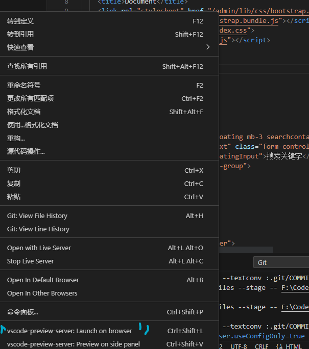
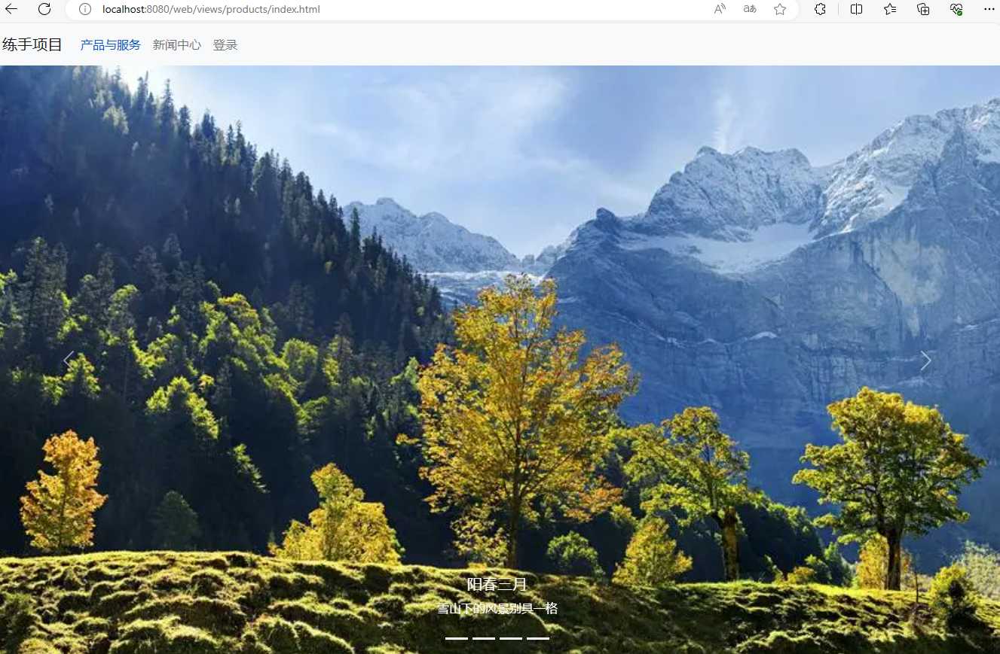

# 说明

>  非常简单的一个原生js的项目，整个流程一目了然，适合作为入门练习。

>  如果对您有帮助，您可以点右上角 "Star" 支持一下 谢谢！ ^_^

>  开发环境 nodejs


## 项目运行（node v18.17.1）
``` bash
# 克隆到本地
git clone https://github.com/Tsing09073/code.git


# 安装依赖
 json-server --watch .\db.json --port 5000

 #所有调用的端口都是5000

```
### 运行用倒数第二个插件，用其他插件会导致有些东西加载不出来


### 首页

### 管理界面

